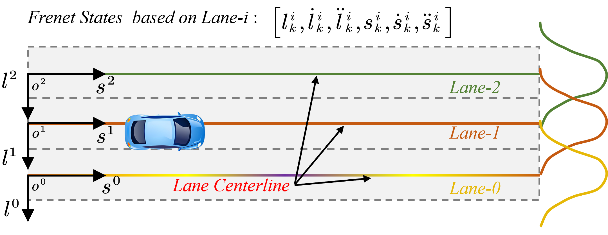
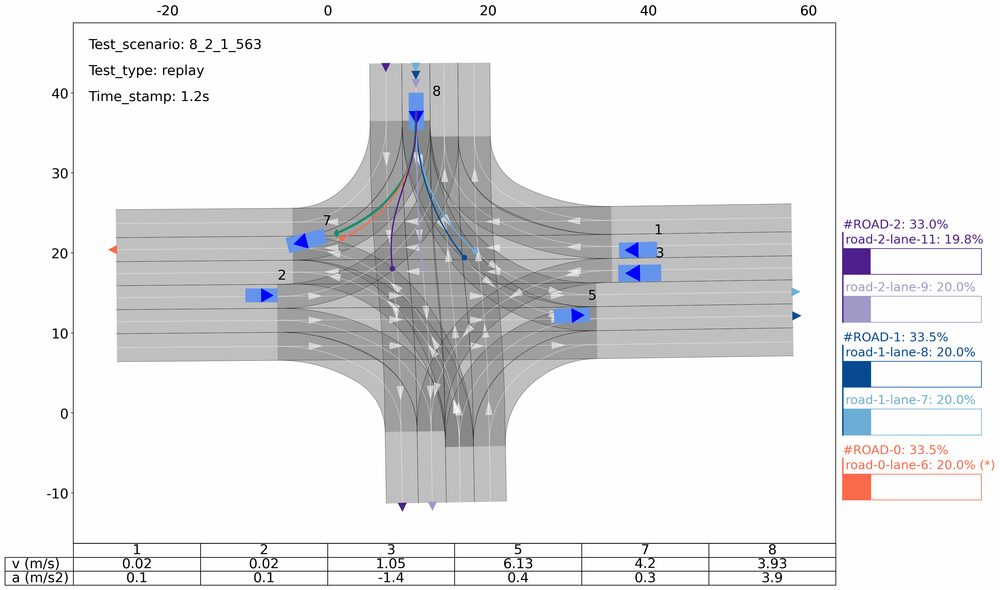

---
---

# DLII-JSSP

> This repo is the implementation of the following paper: 
>
> **"Efficient Sampling-based Trajectory Planning with Dual-Layer Probabilistic Intention Prediction for Autonomous Driving in Complex Intersections"** 
>
> 
>
> *The open-source code will be published here.*
>
> #### To-Do List
>
> - Results [Completed]
> - Datasets [Completed]
> - Code [In Progress]

 

## 0. Introduction


## 1. Set up your virtual environment

- Create a virtual environment using conda (python3.9)

  ```bash
  conda create -n dlii python=3.9
  ```

- Activate the virtual environment

  ```bash
  conda activate dlii
  ```

- Install python dependency packages via pip. Open the project directory as follows ` ../setup/requirements.txt `, install dependency package.

  ```bash
  pip install -r setup/requirements.txt
  # Speed up (use pip source in China)
  pip install -r setup/requirements.txt -i https://pypi.tuna.tsinghua.edu.cn/simple
  ```

  

## 2. Preparation

### 2.1 Download the code and data

- Clone this repo from the GitHub.

```bash
 git clone git@github.com:byChenZhifa/DLII-JSSP.git
```

- Download the all scenarios data [[here](https://github.com/byChenZhifa/DLII-JSSP.git)] and save it to project directory `./data_scenarios` .

  - 8 scenes demo: `scenes_demo(8 for planning ablation study).zip`
  -  all the intersection scenes:  `scenes_all(800).tar.xz`

```bash
 cd DLII-JSSP
 mkdir data_scenarios
```

3. run.

### 2.2 Suggested structure for the project code

> TODO

## 3. Our test results

Note: This framework initiates with a **high-layer inference for the target road** and subsequently **refines this prediction for the target lane**.


Fig. 2. Schematic diagram of dual-layer intention inference for road layer and lane layer


**Fig. 4.** Schematics on the conversion from Cartesian frame to Frenet frame.



**Fig. 6.** Multiple Lane Centerline Models based on Lane Frenet States inside One Road

### 3.1 More results for trajectory predictor

#### Test scenario :7_28_1_89, vehicle #4 turn left test using two method. (CVCYR, Our predictor with IMM)

##### CVCYR


##### Our predictor with IMM


#### Test scenario :8_2_1_563, vehicle #8 going straight and changing lanes.(CVCYR, Our predictor with IMM)

##### CVCYR


##### Our predictor with IMM



#### Test scenario :8_3_1_54, vehicle # 3 turn right.(CVCYR, Our predictor with IMM)

##### CVCYR


##### Our predictor with IMM


### 3.2 More results for trajectory planner

Note: Some results of trajectory planning using predefined linear strategies .

#### Test scenario : JSSP-8_3_4_565


#### Test scenario : JSSP-8_8_1_135


#### Test scenario : JSSP-8_32_left_straight_in_opposite_36


#### Test scenario : JSSP-8_9_2_332


#### Test scenario : JSSP-10_60_straight_in_adjacent_left_61


## Contact us

If you have any issues with the code, please contact to this email: [chenzhifa@buaa.edu.cn](chenzhifa@buaa.edu.cn)

## Citation

If you find our work useful for your research, please consider citing the paper.

> TODO

## reference

- https://github.com/SS47816/fiss_plus_planner
- 


